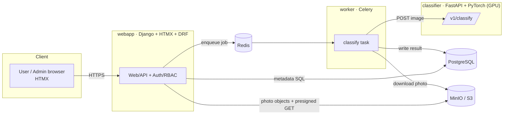

# Photo Classification Platform

A cloud-deployable, microservices web platform where users register, upload a
photo plus profile metadata, and receive an automated **classification result**;
admins can search/filter all submissions. Built for the assessment brief in
[task.txt](task.txt).

- **2 first-class microservices** — a Django web/API service and a GPU model
  server — plus Celery workers and Postgres/Redis/MinIO infrastructure.
- **Runs entirely in Docker Compose**, on deliberately uncommon host ports so it
  won't clash with your other projects.
- **Kubernetes manifests + GitHub Actions** included (configs + documented
  strategy).

> **TL;DR**
> ```bash
> cp .env.example .env
> docker compose up --build          # add: -f docker-compose.gpu.yml  for the GPU
> # open http://localhost:47080  ·  API docs: http://localhost:47080/api/docs/
> # admin login: admin@example.com / admin12345
> ```

---

## Architecture at a glance



Profile (name, age, place of living, gender, country, description) is collected
once at **onboarding**; a submission is then **photo-only** and snapshots that
profile. A submission flows: **upload photo → snapshot profile + validate/strip/
store photo → save (`PENDING`) → enqueue → worker calls the classifier → write
result (`DONE`) → HTMX polls and shows it.** Full write-up in
[ARCHITECTURE.md](ARCHITECTURE.md);
editable diagram in [docs/architecture.drawio](docs/architecture.drawio).

## Services & ports

| Service | Description | Host port (default) | In-container |
|---|---|---|---|
| `webapp` | Django + HTMX UI, DRF API, auth/RBAC | **47080** | 8000 |
| `worker` | Celery worker (classification jobs) | — | — |
| `classifier` | FastAPI + PyTorch GPU model server | **47088** | 8000 |
| `postgres` | Metadata database | **47432** | 5432 |
| `redis` | Celery broker/result + cache | **47379** | 6379 |
| `minio` | Photo object storage (S3 API) | **47900** | 9000 |
| `minio` console | MinIO web console | **47901** | 9001 |

All host ports are configurable in `.env` (the `*_HOST_PORT` variables).

## Tech choices (why)

| Area | Choice | Rationale |
|---|---|---|
| Web/API + both UIs | **Django + HTMX + DRF** | Batteries-included auth/ORM/migrations/admin; HTMX gives dynamic UI with no SPA build; DRF + drf-spectacular gives a validated, **Swagger**-documented API. |
| Model server | **FastAPI + PyTorch** | Lean, async, GPU-friendly; isolates heavy ML deps and scales independently. |
| Database | **PostgreSQL** | Relational integrity + rich indexing for the admin filters; see [docs/database.md](docs/database.md). |
| Object storage | **MinIO (S3-compatible)** | Photos as blobs, not DB rows; swap for S3/GCS unchanged in cloud. |
| Async | **Celery + Redis** | Decouples slow GPU inference from the request cycle; HTMX polls for the result. |

## Classification model

Thematically matched to the profile metadata: **face/person attribute analysis**
(age + gender) with an **NSFW safety gate**. Real Hugging Face models run on the
GPU (`MODEL_DEVICE=auto`, well under 6 GB VRAM) and fall back to CPU when no GPU
is present. The model is **pluggable** behind a stable `POST /v1/classify`
contract — set `AGE_MODEL_ID` / `GENDER_MODEL_ID` (or swap in a small VLM).
Set `CLASSIFIER_STUB=1` for a fast, dependency-free dummy classifier.

## Running

### Default (real model, CPU-auto)
```bash
cp .env.example .env
docker compose up --build
```
First classifier start downloads the models (~a few hundred MB).

### With GPU (NVIDIA Container Toolkit required)
```bash
docker compose -f docker-compose.yml -f docker-compose.gpu.yml up --build
```

### Fast/lightweight (no ML download — stub classifier)
```bash
# in .env set CLASSIFIER_STUB=1, then build the slim classifier image:
INSTALL_TORCH=false CLASSIFIER_STUB=1 docker compose up --build
```

Then open:
- **App**: http://localhost:47080
- **API docs (Swagger)**: http://localhost:47080/api/docs/
- **MinIO console**: http://localhost:47901 (`minioadmin` / `minio-dev-password`)
- Default admin: `admin@example.com` / `admin12345` (from `.env`)

A full click-through demo script is in [docs/runbook.md](docs/runbook.md).

## Tests & linting

```bash
# webapp
cd webapp && pip install -r requirements-dev.txt && ruff check . && black --check . && pytest
# classifier (stub mode — no torch needed)
cd classifier && pip install -r requirements-dev.txt && ruff check . && black --check . && CLASSIFIER_STUB=1 pytest
```
CI runs exactly this matrix on every push/PR (see [.github/workflows/ci.yml](.github/workflows/ci.yml)).

## Kubernetes

Manifests live in [k8s/](k8s/) (kustomize `base` + `dev`/`prod` overlays):
GPU-scheduled classifier, HPAs, probes, secrets template, ingress + TLS.
```bash
kubectl kustomize k8s/overlays/dev      # render
kubectl apply -k k8s/overlays/dev       # deploy (after supplying platform-secrets)
```
Scaling, secrets and observability strategy: [docs/kubernetes.md](docs/kubernetes.md).

## Documentation map

| Doc | Contents |
|---|---|
| [ARCHITECTURE.md](ARCHITECTURE.md) | Components, request flow, decisions, trade-offs |
| [docs/api.md](docs/api.md) | Endpoint reference (also live at `/api/docs/`) |
| [docs/database.md](docs/database.md) | DB choice, schema, indexing, migrations |
| [docs/safety.md](docs/safety.md) | Safety rules — what / where / why |
| [docs/kubernetes.md](docs/kubernetes.md) | Scaling, secrets, observability |
| [docs/runbook.md](docs/runbook.md) | Demo / screen-recording script |
| [docs/architecture.drawio](docs/architecture.drawio) | Editable architecture diagram |

## Repository layout

```
webapp/        Django + HTMX + DRF + Celery (the web/API microservice)
classifier/    FastAPI + PyTorch GPU model server
k8s/           kustomize base + dev/prod overlays
.github/       CI (lint/test/build/push) + CD (documented deploy)
docs/          architecture, api, database, safety, kubernetes, runbook, diagram
docker-compose.yml / docker-compose.gpu.yml / .env.example
```
